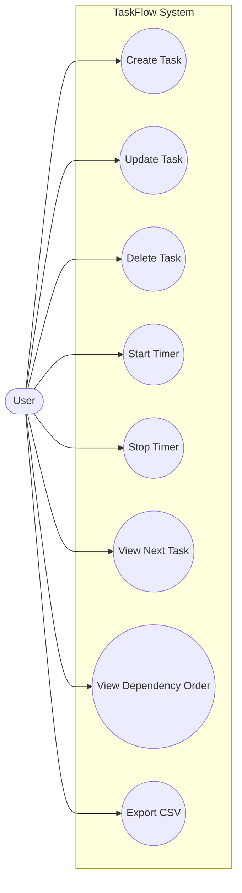
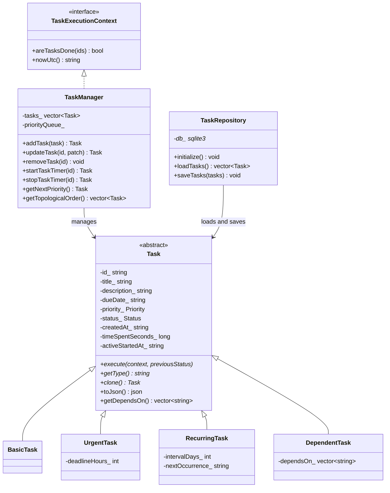
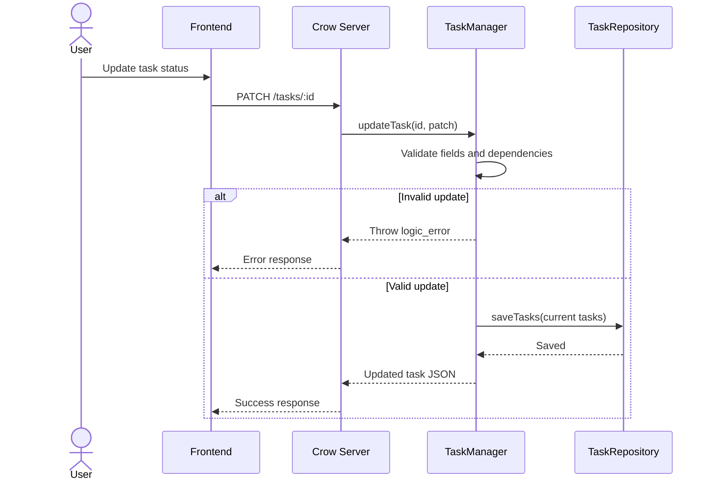
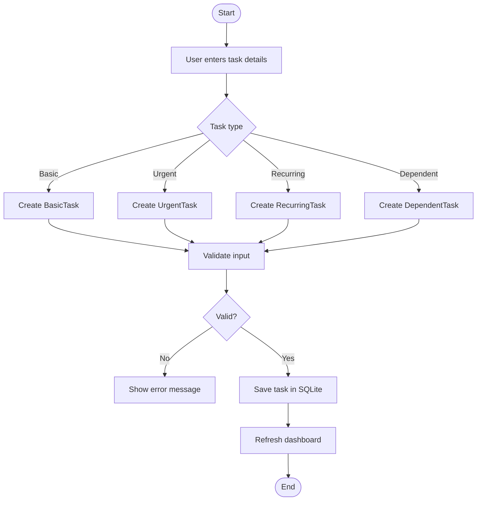

# TaskFlow Task Manager System

## 1. ABSTRACT
TaskFlow is a task management system developed as an object-oriented programming project. It is designed to help users create, organize, track, and complete tasks in a structured way. The system supports multiple task categories, including basic tasks, urgent tasks, recurring tasks, and dependent tasks. Each type behaves differently, which makes the application useful for demonstrating real OOP principles in a practical environment.

The backend is implemented in C++17 using Crow for HTTP routing, SQLite for persistent storage, and CMake for the build system. The frontend is built with Next.js, TypeScript, and Tailwind CSS, which provides a responsive browser-based interface for interacting with the task manager. The frontend communicates with the backend through a typed API layer, so task updates, timer actions, filters, ordering, and export operations all happen through a consistent contract.

The system solves a common planning problem: simple to-do lists are not enough when tasks have deadlines, priorities, dependencies, or time tracking requirements. TaskFlow addresses this by combining a task hierarchy, dependency validation, priority ordering, live timer tracking, and permanent database storage. The result is a compact but complete task management platform that is suitable for academic work, project planning, and small productivity workflows.

In addition to solving a useful problem, the project demonstrates how abstraction, encapsulation, inheritance, and polymorphism can be applied in a working application. It also shows how a backend service, database layer, and frontend UI can be designed as separate modules while still working together as one system.

## 2. INTRODUCTION

### Background
Students and project teams often deal with multiple assignments, lab submissions, revision plans, meetings, and personal tasks at the same time. A plain notebook or a simple checklist can store items, but it does not manage priority, task relationships, or progress tracking in a reliable way. When tasks depend on each other, or when one task must be marked urgent, a basic list quickly becomes difficult to use.

### Problem Statement
The main problem is the lack of a structured task manager that can handle different kinds of tasks without losing clarity. Users need a system that can:

- keep tasks organized by type and status
- prevent invalid updates for dependent tasks
- show the next task that should receive attention
- track active work time on a task
- store information permanently so it is not lost after restart

### Objectives
The project has four main objectives:

- build a usable task manager with a clean web interface
- apply OOP concepts in a practical codebase
- enforce task rules such as dependency checks and priority handling
- keep task data persistent through SQLite storage

### Scope
The scope of the application includes task creation, editing, deletion, timer start and stop actions, dependency ordering, CSV export, search, filtering, and task detail viewing. The system is intended for a single-user academic or personal productivity setting, but the architecture is modular enough that it can be expanded later.

### Functional Requirements
The system should support:

- creating basic, urgent, recurring, and dependent tasks
- updating title, description, due date, priority, and status
- starting and stopping timers for time tracking
- viewing tasks in dependency-safe order
- exporting task data in CSV format
- loading stored tasks when the backend starts

### Non-Functional Requirements
The system should also be:

- responsive in the browser
- reliable in task validation
- easy to maintain and extend
- consistent across backend and frontend modules
- lightweight enough for local development and academic use

## 3. OOPS CONCEPTS USED

### Abstraction
Abstraction is used to expose only the necessary behavior of a task while hiding the internal details. The `Task` class acts as an abstract base class, and `TaskExecutionContext` is used as an interface-like contract for manager services. This keeps the task logic independent from the full internal implementation of the manager.

### Encapsulation
Encapsulation is used to protect task data inside the class. Fields such as task ID, title, description, due date, priority, status, creation time, and timer state are stored privately inside `Task`. They are accessed through methods instead of direct external modification. This reduces accidental misuse and keeps the state consistent.

### Inheritance
Inheritance is used to create specialized task types from a common parent. `BasicTask`, `UrgentTask`, `RecurringTask`, and `DependentTask` all inherit from `Task`. This avoids duplicate code for shared fields and behaviors, while still allowing each subtype to add its own rules.

### Polymorphism
Polymorphism allows the system to call the correct behavior at runtime based on the actual task type. The virtual functions `execute`, `getType`, `clone`, and `toJson` allow different task objects to respond differently through the same base-class pointer. For example, an urgent task can force priority rules, a recurring task can update its next occurrence, and a dependent task can block invalid status changes.

### Classes and Objects
The system is organized around classes and objects. Each task created by the user becomes an object of the proper subtype. The manager keeps these objects in memory, applies business rules, and rebuilds the task order when changes occur. This is a direct demonstration of how objects model real-world entities in OOP.

### Factory Pattern
Task creation is centralized in `taskFromJson(...)` inside `TaskFactory.h`. This function reads the `type` field from JSON and creates the correct class instance. The factory pattern keeps object creation in one place and makes the rest of the code simpler.

### Concept Summary

| Concept | How It Is Used | Benefit |
| --- | --- | --- |
| Abstraction | Abstract task behavior and execution context | Hides internal rules and reduces coupling |
| Encapsulation | Private task state with public methods | Protects data from unsafe direct access |
| Inheritance | Task subtypes extend a common base | Reuses code and keeps design modular |
| Polymorphism | Runtime dispatch through virtual methods | Supports subtype-specific behavior |
| Factory Pattern | JSON-based task object creation | Centralizes object creation logic |

## 4. SYSTEM ANALYSIS

### Existing System
In many common task tracking methods, tasks are stored in a flat list or in a simple note-taking app. Such systems usually allow a title and a date, but they do not properly handle task priority, dependencies, or work tracking. They are suitable for very small lists, but they become weak when tasks need more structure.

### Limitations of the Existing System

- no support for separate task types
- no dependency validation before status changes
- no automatic priority ordering
- no timer tracking for active work
- no structured persistence for restart recovery
- no export option for reporting or submission

### Proposed System
TaskFlow is proposed as a structured task manager with a C++ backend and a modern web frontend. The backend enforces the task rules, the database keeps the data persistent, and the frontend provides a friendly interface for day-to-day use. The proposed system improves usability while also being a better demonstration of OOP design.

### Feasibility Analysis

#### Technical Feasibility
The chosen stack is realistic for local development. C++17, Crow, SQLite, Next.js, TypeScript, and Tailwind CSS are all widely used technologies. The implementation is modular enough to support future extension without requiring a full rewrite.

#### Operational Feasibility
The application is simple to run once dependencies are installed. The backend starts on port 8080, the frontend starts on port 3000, and the browser provides the main interface. The workflow is practical for students and individual users.

#### Economic Feasibility
The stack uses open-source tools and a local SQLite database, so there are no licensing costs for the core system. That makes the project affordable and easy to reproduce.

### Requirement Analysis
The system needs a clear separation of concerns:

- domain objects for task types
- a manager for validation and ordering
- a persistence layer for SQLite storage
- a frontend for display and user actions

This separation reduces complexity and makes future maintenance easier.

### Comparison of Existing and Proposed Systems

| Aspect | Existing Approach | TaskFlow |
| --- | --- | --- |
| Task structure | Single flat list | Multiple specialized task types |
| Dependency handling | Usually absent | Enforced and validated |
| Priority support | Limited | Built into ordering rules |
| Timer tracking | Not available | Supported |
| Storage | Temporary or manual | Persistent SQLite storage |
| Reporting | Minimal | CSV export available |
| User interface | Basic | Modern web dashboard |

## 5. SYSTEM DESIGN USING UML DIAGRAMS

### Use Case Diagram

This diagram shows the main actions available to the user. The system is centered on task management, timer control, dependency inspection, and export support.

### Class Diagram

This diagram shows the task hierarchy and the backend layers. The base class stores common data, while each derived class adds its own behavior.

### Sequence Diagram

This sequence explains how a task update moves through the system. Validation happens before persistence, which protects the stored state from invalid changes.

### Activity Diagram

This activity diagram shows the task creation flow. The system validates the data, stores it only if it is valid, and then updates the user interface.

## 6. IMPLEMENTATION DETAILS

### Backend Implementation
The backend is centered around `backend/src/main.cpp`, which wires the HTTP routes to the task manager and repository. The application loads existing tasks from SQLite at startup, applies domain rules through `TaskManager`, and saves changes after every mutation. A mutex protects shared state because the server runs multithreaded. The backend also performs timer rollup and periodic persistence while tasks are running.

### Domain Model
Task behavior is implemented in the model layer under `backend/src/models/`. `Task` holds common data, while the derived classes implement task-specific logic:

- `BasicTask` for a standard task
- `UrgentTask` for tasks with urgent priority rules
- `RecurringTask` for repeating tasks and next occurrence updates
- `DependentTask` for tasks that must wait on other tasks

`taskFromJson(...)` acts as the main factory. It reads the `type` field from JSON and creates the correct concrete class. That keeps object creation centralized and makes database loading and API parsing consistent.

### Manager Logic
`TaskManager` handles the core business rules. It validates dependencies, rejects cycles, manages the priority queue, and exposes methods for add, update, delete, timer start, timer stop, next task lookup, and topological ordering. The class also implements `TaskExecutionContext`, which allows task objects to ask the manager whether dependencies are complete and to request the current UTC time.

### Persistence Layer
`TaskRepository` is responsible for loading and saving tasks in SQLite. The repository persists the full current snapshot of tasks, which keeps the implementation simple and deterministic. On startup, stored tasks are hydrated back into the domain model so the application resumes from the last saved state.

### Frontend Implementation
The frontend is a Next.js App Router application. The main dashboard page in `frontend/app/page.tsx` performs an initial server-side fetch and passes the data to `DashboardClient`. The dashboard client uses state, deferred search input, transition-based filter updates, and periodic refreshes for live timer behavior.

The visible UI is split into reusable components:

- `dashboard-client.tsx` for task orchestration and page state
- `task-board.tsx` and `TaskBoard.tsx` for task display
- `task-detail-view.tsx` for detailed task inspection
- `create-task-dialog.tsx` for task creation
- `dependency-panel.tsx` for dependency display
- `ExportButton.tsx` for CSV download

The frontend uses the typed API client in `frontend/lib/api.ts` and supporting utilities in `frontend/lib/tasks.ts`, `frontend/lib/server-api.ts`, and `frontend/lib/utils.ts`.

### API Surface
The backend exposes the following endpoints:

- `GET /tasks`
- `POST /tasks`
- `PATCH /tasks/:id`
- `DELETE /tasks/:id`
- `POST /tasks/:id/start`
- `POST /tasks/:id/stop`
- `GET /tasks/next`
- `GET /tasks/order`
- `GET /export`

These endpoints support the full task lifecycle and match the actions that the frontend needs.

### Build and Run Flow
The implementation follows a clear local workflow:

- configure the backend with CMake
- build the backend binary
- install frontend dependencies
- run the backend on port 8080
- run the frontend on port 3000
- open the dashboard in a browser and interact with tasks

This separation keeps development straightforward and makes debugging easier.

## 7. OUTPUT SCREENS & RESULTS
This section is intended for the screenshots and final UI captures that you will insert separately. The report text below explains what each screen should show and what result it demonstrates.

| Screen | What It Should Show | Result Demonstrated |
| --- | --- | --- |
| Dashboard Home | Task board, search bar, filters, summary strip, Next Up button, Export button | The main workflow of the app is visible in one place |
| Task Detail View | Full task information, timer controls, status control, dependency panel | A single task can be inspected and managed in detail |
| Create Task Dialog | Fields that change by task type | The system supports multiple task categories |
| Validation Message | Error when a dependent task is updated too early | Business rules are enforced correctly |
| Export Result | Downloaded `tasks.csv` or export confirmation | The data can be extracted for reporting |

### Expected Result Notes
The dashboard should show tasks in a visually organized layout with clear priority and status indicators. The detail screen should make it easy to see the selected task, its tracked time, and its related tasks. The create dialog should prove that the form is dynamic and supports each subtype. If a user tries to move a dependent task forward before its prerequisites are done, the application should reject the action and show a clear message. The CSV export should confirm that the backend can serialize the full task list into a simple file format.

### Suggested Captions

- Dashboard interface after tasks have been added
- Task detail screen showing timer and dependency data
- Create task form with subtype-specific fields
- Error shown when dependency rules are violated
- CSV export generated from the current task list

## 8. TESTING

### Test Strategy
Testing is done at multiple levels so the system can be checked from the domain layer up to the UI build. The backend has direct C++ assertion-based tests, the HTTP flow can be verified through the smoke script, and the frontend can be checked through the production build command.

### Backend Logic Tests
The backend test executable in `backend/tests/task_manager_tests.cpp` covers the main rules of the system:

- task creation for each subtype
- urgent task priority behavior
- recurring task next occurrence handling
- dependent task status blocking
- timer start, rollup, and stop behavior
- task deletion
- topological ordering
- cycle detection
- SQLite persistence round-trip

### Example Test Cases

| Test Case | Input | Expected Result |
| --- | --- | --- |
| Create basic task | Valid title, due date, and priority | Task is created successfully |
| Create urgent task | Urgent subtype with deadline value | Task is marked urgent |
| Complete recurring task | Change status to DONE | Next occurrence is updated |
| Update dependent task too early | Dependencies are not DONE | Update is rejected |
| Start and stop timer | Start timer, wait, stop timer | Tracked time increases correctly |
| Introduce dependency cycle | Create circular dependency | System rejects the cycle |
| Save and reload database | Persist tasks and load again | Same tasks are restored |

### Command-Level Checks
The repository also supports practical command-level verification:

- `cd backend && ctest --test-dir build --output-on-failure`
- `cd backend && ./smoke.sh`
- `cd frontend && npm run build`

These checks confirm that the backend logic, HTTP layer, and frontend production build are all working.

### Manual Verification
Manual testing should include:

- creating each task type through the UI
- updating task status and priority
- starting and stopping timers
- checking dependency ordering
- filtering and searching tasks
- exporting CSV data
- refreshing the page and confirming persistent reload behavior

This combination of automated and manual testing gives good confidence that the application behaves correctly.

## 9. FUTURE ENHANCEMENT
TaskFlow already covers the core functionality of a structured task manager, but it can still be extended in several useful ways.

### Short-Term Enhancements

- user authentication and account separation
- undo and redo for task actions
- better notifications for due dates and overdue tasks
- richer validation messages in the UI
- tags, labels, and categories for task grouping

### Medium-Term Enhancements

- multi-user collaboration
- calendar integration
- email or desktop reminders
- recurring-rule controls beyond fixed intervals
- attachments and supporting documents for tasks

### Long-Term Enhancements

- analytics dashboard with productivity trends
- mobile-friendly or PWA support
- dark and light theme switching
- role-based access control
- cloud sync instead of local-only storage

These improvements would move the project from an academic task manager toward a more complete productivity platform.

## 10. CONCLUSION
TaskFlow demonstrates how object-oriented programming can be applied to a real task management system. The project combines abstraction, encapsulation, inheritance, and polymorphism with practical backend and frontend development. The task hierarchy, factory-based object creation, dependency validation, and timer support make the system more than a simple to-do list.

The project also shows the value of separating responsibilities across modules. The frontend handles user interaction, the manager handles business rules, the repository handles persistence, and the model layer handles task-specific behavior. This structure makes the code easier to understand, test, and extend.

From a student project perspective, TaskFlow is useful because it demonstrates both theory and implementation. It covers core OOP ideas, database storage, API design, UI development, and testing in one system. If expanded later with authentication, notifications, and collaboration features, it could become a much more complete productivity application.

## 11. REFERENCES

- E. Balagurusamy, *Object Oriented Programming with C++*
- Crow C++ web framework documentation
- SQLite official documentation
- Next.js official documentation
- React official documentation
- TypeScript official documentation
- Tailwind CSS official documentation
- CMake documentation
- nlohmann/json documentation
- Project source files in `README.md` and `backend/README.md`

