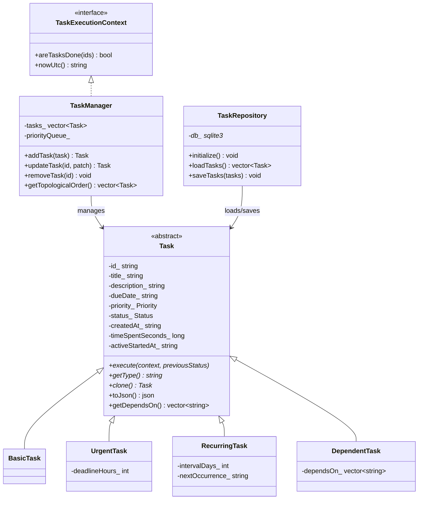

# Backend Architecture Documentation

This backend is a C++17 task API built with Crow (HTTP), SQLite (storage), and CMake.

## High-Level Design

Core layers:

- `models/`: task domain model and subtype behavior
- `manager/`: orchestration, business rules, ordering
- `persistence/`: SQLite load/save
- `main.cpp`: HTTP routes and integration wiring

Request flow:

1. Route in `main.cpp` receives request.
2. JSON payload converted to domain objects with `taskFromJson(...)`.
3. `TaskManager` applies domain rules and mutates in-memory state.
4. `TaskRepository` persists full current state to SQLite.
5. Response sent as JSON or CSV.

## OOP Concepts Used

### 1) Abstraction

- `Task` is abstract base class (`execute`, `getType`, `clone` pure virtual).
- `TaskExecutionContext` is abstract context interface used by model logic:
  - `areTasksDone(...)`
  - `nowUtc()`

Why: task subclasses can enforce behavior without tight coupling to `TaskManager` internals.

### 2) Inheritance

Task hierarchy:

- `Task` (base)
- `BasicTask`
- `UrgentTask`
- `RecurringTask`
- `DependentTask`

Each subclass extends base data model with type-specific behavior/fields.

### 3) Polymorphism

Polymorphic calls happen via `std::shared_ptr<Task>`:

- `execute(...)` dispatches subtype logic at runtime.
- `toJson()` overridden when subtype has extra fields.
- `clone()` used for deep-copy snapshots/history.

Examples:

- `UrgentTask::execute` forces `priority = URGENT`.
- `RecurringTask::execute` sets `nextOccurrence` when status transitions to `DONE`.
- `DependentTask::execute` blocks status advancement unless all dependencies are `DONE`.

### 4) Encapsulation

- `Task` fields are private with getters/setters.
- `TaskManager` owns state containers (`tasks_`, priority queue) as private members.
- Update constraints enforced centrally (`id/type/createdAt` immutable, subtype field checks, cycle checks).

### 5) Factory Pattern

- `TaskFactory.h` provides `taskFromJson(...)`.
- Chooses concrete subclass from `type` field.
- Validates and parses core fields (`dueDate`, enums, defaults).

### 6) Strategy-like Comparator

- `TaskManager::TaskCompare` defines priority queue ordering:
  1. higher priority first
  2. earlier due date first
  3. earlier created time first

## Domain Rules in `TaskManager`

### CRUD + Validation

- `addTask`: clone input, validate dependencies, run subtype `execute`, detect cycle, commit.
- `updateTask`: patch mutable fields, validate subtype-specific fields, run subtype `execute`, detect cycle.
- `removeTask`: blocked if any task depends on target.

### Dependency Integrity

- `validateDependencies(...)`: each dependency must exist; no self-dependency.
- `ensureAcyclic(...)`: Kahn-style indegree traversal; throws on cycle.
- `getTopologicalOrder()`: returns dependency-safe ordering; throws on missing dependency/cycle.

### Timer Tracking

- `startTaskTimer`: sets `activeStartedAt`.
- `rollupRunningTimers`: for running tasks, adds elapsed seconds since `activeStartedAt`, then moves `activeStartedAt` to rollup time.
- `stopTaskTimer`: computes final elapsed seconds from `activeStartedAt` to now, adds to `timeSpentSeconds`, clears running state.
- In HTTP layer, read routes trigger rollup and persist roughly every 5 seconds while timers are active.

## Persistence Layer (`TaskRepository`)

Storage model:

- Single `tasks` table with common columns + nullable subtype columns:
  - `deadline_hours`, `interval_days`, `next_occurrence`, `depends_on_json`, `active_started_at`

Key behaviors:

- `initialize()`: creates schema if missing.
- `loadTasks()`: reads rows -> JSON -> `taskFromJson(...)`.
- `saveTasks()`: transaction, truncate table, insert current state.

Note: repository persists full in-memory snapshot each write (simple and deterministic).

## HTTP API Surface (`main.cpp`)

Main endpoints:

- `GET /tasks`
- `POST /tasks`
- `PATCH /tasks/:id`
- `DELETE /tasks/:id`
- `POST /tasks/:id/start`
- `POST /tasks/:id/stop`
- `GET /tasks/next`
- `GET /tasks/order`
- `GET /export` (CSV)

Error handling wraps route logic with shared guard helpers in `routes/HttpUtils.h`.

## Data Lifecycle Example

Dependent task status update:

1. Client sends `PATCH /tasks/:id` with status `IN_PROGRESS`.
2. `TaskManager::updateTask` patches status.
3. Runtime dispatch calls `DependentTask::execute(...)`.
4. `execute` asks context (`TaskManager`) if all dependency IDs are `DONE`.
5. If not done -> throws `logic_error`, update rolled back (candidate state not committed).
6. If valid -> state committed, queue rebuilt, repository saved.

## Tests Coverage (`tests/task_manager_tests.cpp`)

Current test executable covers:

- subtype behavior (urgent priority, recurring next occurrence, dependent status blocking)
- priority ordering
- timer start/stop lifecycle + rollup behavior without double-count
- delete
- dependency topological ordering
- cycle detection on read and on update
- SQLite persistence round-trip

## UML: Class Diagram



## UML: Sequence (PATCH /tasks/:id)

```mermaid
sequenceDiagram
  autonumber
  participant C as Client
  participant A as Crow Route (main.cpp)
  participant M as TaskManager
  participant T as Task subtype (runtime)
  participant R as TaskRepository
  participant DB as SQLite

  C->>A: PATCH /tasks/:id {patch}
  A->>M: updateTask(id, patch)
  M->>T: execute(context, previousStatus)
  T-->>M: validate/apply subtype rules
  M->>M: validateDependencies + ensureAcyclic
  M-->>A: updated Task
  A->>R: saveTasks(manager.getTasks())
  R->>DB: BEGIN; DELETE; INSERT...; COMMIT
  DB-->>R: ok
  R-->>A: persisted
  A-->>C: 200 + task JSON
```
